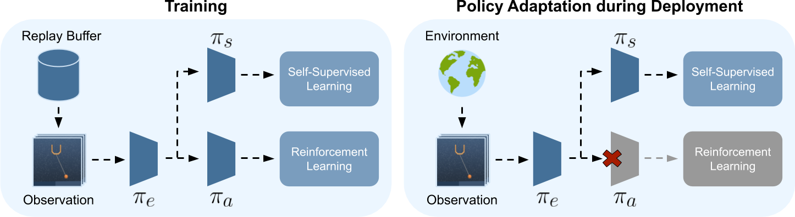

# Self-Supervised Policy Adaptation during Deployment revisited

This work is an adaptation from

**Self-Supervised Policy Adaptation during Deployment**

[Nicklas Hansen](https://nicklashansen.github.io/), [Rishabh Jangir](https://jangirrishabh.github.io/), [Yu Sun](https://yueatsprograms.github.io/), [Guillem Alenyà](http://www.iri.upc.edu/people/galenya/), [Pieter Abbeel](https://people.eecs.berkeley.edu/~pabbeel/), [Alexei A. Efros](https://people.eecs.berkeley.edu/~efros/), [Lerrel Pinto](https://cs.nyu.edu/~lp91/#), [Xiaolong Wang](https://xiaolonw.github.io/)

[[Paper]](https://arxiv.org/abs/2007.04309) [[Website]](https://nicklashansen.github.io/PAD/)




The paper and the code can be found [here](https://nicklashansen.github.io/PAD/).

## Setup
We assume that you have access to a GPU with CUDA >=9.2 support. All dependencies can then be installed with the following commands:

```
conda env create -f setup/conda.yml
conda activate pad
sh setup/install_envs.sh
```

## Adapting agents Training & Evaluation
We have prepared training and evaluation scripts that can be run on a cluster by ```sbatch scripts/sbatch_train.sh``` and ```sbatch scripts/sbatch_eval.sh```. Alternatively, you can call the python scripts directly, e.g. for training call. 

```
CUDA_VISIBLE_DEVICES=0 python3 src/train.py \
    --domain_name cartpole \
    --task_name swingup \
    --action_repeat 8 \
    --mode train \
    --use_inv \
    --num_shared_layers 8 \
    --seed 0 \
    --work_dir logs/cartpole_swingup/inv/0 \
    --save_model
```
```
CUDA_VISIBLE_DEVICES=0 python3 src/train.py \
    --domain_name walker \
    --task_name walk \
    --action_repeat 4 \
    --mode train \
    --use_inv \
    --num_shared_layers 8 \
    --seed 0 \
    --work_dir logs/walker_walk/inv/0 \
    --save_model
```

We provide two pre-trained models that can be used for evaluation, namely the cartpole and the walker. To run Policy Adaptation during Deployment, call
Please refer to the original paper and to `src/arguments.py` for more information on the commands. 

## Building environment baselines
To build the experiments leading to environment baselines, we provided the following script : `scripts/sbatch_baselines.sh`. The domain, the task, the window and the dynamics (eg. cart_mass) specifications can be changed.

## Imitation learning

Below we list the available scripts and their usage. Please refer to our report and to `src/arguments.py` for more information on the commands. 
To evaluate any agent on a particular domain, we provided the script `scripts/sbatch_eval_domain.sh`. The dynamics specifications along with the agent domain and task can be modified if needed. 

### Experts training
To train an expert agent, we provided the script `scripts/sbatch_train_expert.sh`. The dynamics options (eg. force_walker or cart_mass) along with the working directory can be changed to train an agent on another domain. 
To train domain-generic agents, we provided the script `scripts/sbatch_domain_generic.sh`. 
The train experts are available in [Recovery](https://github.com/PhiCtl/Recovery) under `models\RL_expert` and need to be extracted in `logs\cartpole_swingup_0_{mass}\inv\0\model`.

### Imitation learning agents with groundtruth input
To train an imitation learning agent with experts, based on the ground truth value of the domain dynamics, we used the script `scripts/sbatch_il_agent.sh`. 
The trained agents are available in [Recovery](https://github.com/PhiCtl/Recovery) under `models\IL_gt` and need to be extracted in `logs\IL\shared\cartpole_swingup\_0_{mass}\model`.

### Imitation learning agents with visual input
To train an imitation learning with experts, based on a visual input only, we used the script `scripts/sbatch_il_agent_visual.sh`. 
The trained agents are available in [Recovery](https://github.com/PhiCtl/Recovery) under `models\IL_visual` and need to be extracted in `logs\IL_visual\shared\cartpole_swingup\_0_{mass}\model`.

### Imitation learning agents and test-time adaptation
Several functions and tests are detailed and available in `src/tta_il_agent.py`. Please have a look to select one of them. 
The current commands provided in `scripts/sbatch_eval_il_agent.sh` perform learning rate screening for an imitation learning agent trained on domain with cart mass 0.4 and evaluated on domain with cart mass 0.5. 

## Trained models
We do not provide all the models in this repository but they can be found in [Recovery](https://github.com/PhiCtl/Recovery).

## Acknowledgements

We got inspiration from and used the work of [Nicklas Hansen et al.](https://nicklashansen.github.io/PAD/) and Berkeley Deep RL [CS-285](https://github.com/berkeleydeeprlcourse/homework_fall2021/tree/main/hw1) course.
The original DeepMind Control suite is available [here](https://github.com/deepmind/dm_control) and the gym wrapper for it is available [here](https://github.com/denisyarats/dmc2gym).
